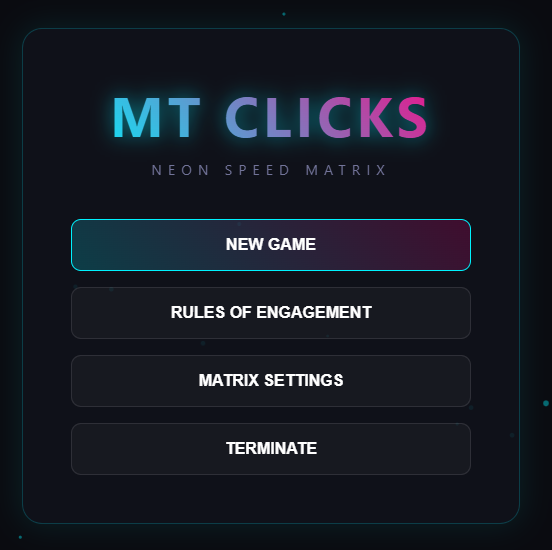
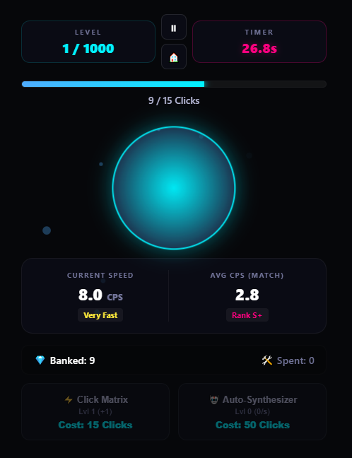

# ⚡ MT Clicks — Neon Speed Matrix
## ▶️ **[Click Here to Play MT Clicks Live](https://mtclicks.vercel.app/)**

A high-octane, cyberpunk reflex game built completely in native JavaScript. Track your CPS (Clicks Per Second) metrics, overclock your clicking infrastructure, and harvest high-yield neon crystals before the system timer reaches zero. 

Featuring live match analytics, dynamic performance grading, and complete session state preservation to pause and resume seamlessly.


## 🎮 Interface & Gameplay Previews

### Main Menu Interface
The clean main dashboard controls entry into the core engine matrix, dynamic run resuming, rules parsing, and safe window termination sequences.



### Core Node Interface & Click Loop
Players interact directly with a morphing neon energy core supported by live diagnostic trackers, a fluid progression timeline, and real-time shop matrices.



---

## 🕹️ How to Play

* **The Core Node:** Click or tap the large central glowing matrix node to generate raw data crystals. 
* **The Countdown:** You must fill your progress gauge to hit the level quota before the timer counts down to `0.0s`. 
* **Dynamic Pause Engine:** Hit the **Pause (⏸)** icon or press `Esc` to freeze the game loop instantly without losing progress. Use the **Home (🏠)** icon to save and hop back to the menu.
* **Critical Boosts:** Watch the node closely! Catching the core during structural gold flashes deals a **3x generation burst** to rocket your banked balance forward.

---

## 🛠️ Diagnostics & Shop Matrix Upgrades

### Speed & Rank Tiers
The engine actively scores your gameplay performance frame-by-frame:
* **Current Speed Index:** Ranges from `Slow` up to `Very Fast` (8.0+ CPS) based on real-time tap intervals.
* **Match Performance Grades:** Ranks your overall runtime efficiency from `Rank D` up to a prestigious `Rank S+`.

### Infrastructure Modules
Spend your harvested crystals in the economy grid to automate your run:
* **⚡ Click Matrix:** Permanently increases the raw power of every manual click.
* **🤖 Auto-Synthesizer:** Spawns autonomous processing clusters to passively farm crystals every second.

---

## 💻 Local Desktop Installation

Want to run the matrix locally on your machine?

1. **Clone the repository pipeline:**
   ```bash
   git clone [https://github.com/mtevan/MT-Clicks.git](https://github.com/mtevan/MT-Clicks.git)
